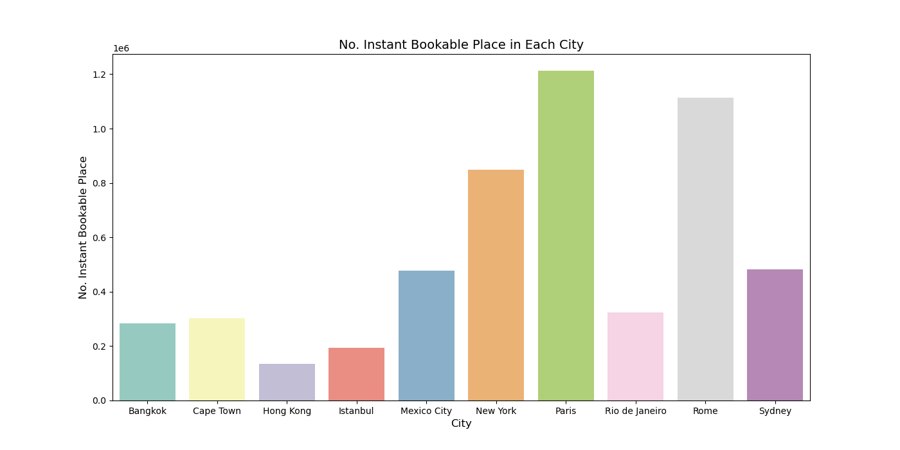
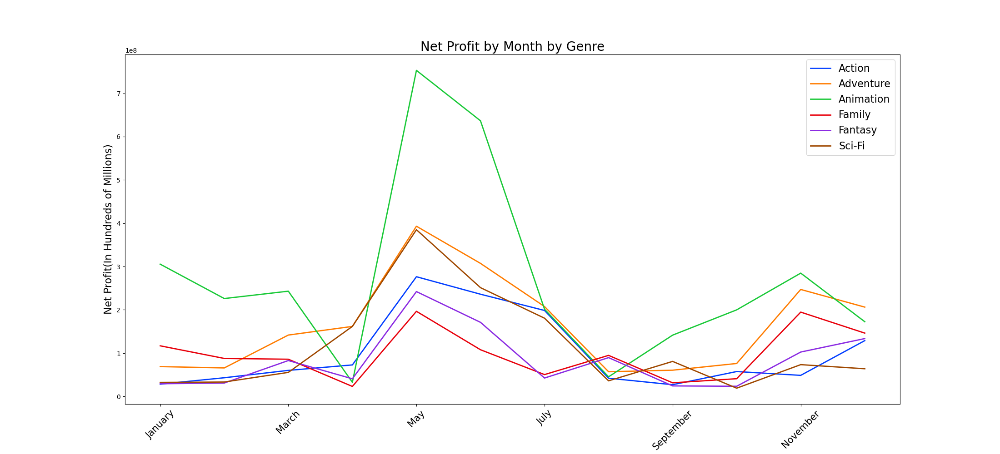

## Portfolio

---

### Data Science
- [E-Commerce - Linear Regression](https://github.com/vietlinh0716/ds-ecommerce-linear-regression) 
   Build a machine learning model to help an eCommerce company in New York to decide which factors help generate more revenue from their customers and to decide if they should focus their resources to develope the website or the app.
 

- [Advertisement -  Logistic Regression Project](https://github.com/vietlinh0716/ds-advertisement-logistics-regression) 
   Create a machine learning model which will predict if a customer will click on the company's ads based on the customer's features information.
 

- [K Nearest Neighbors Project](https://github.com/vietlinh0716/ds-k-nearest-neighbors) 
   Build a machine learning to classify data into binary category based on their features.
 

- [LendingClub - Decision Tree & Random Forest](https://github.com/vietlinh0716/ds-lendingclub-decisiontree-randomforest) 
   Use the data from the LendingClub data set and build a model to predict if a lender will pay back their loands in full based on the lender's information.
 

- [MovieLens - Recommender System](https://github.com/vietlinh0716/ds-movielens-recommender-system) 
   Create a recommender system to recommend similar movies based on the similarity of viewer's feedback and ratings.
 
---

### Data Analysis 

[Data analysis on AirBnB listings](https://github.com/vietlinh0716/data-analysis-airbnb)
 
Use the AirBnB data set to discover the distinctive features among the listings in different cities in the world.

 
---

[Movie EDA](https://github.com/vietlinh0716/data-analysis-movie-eda)
 
Create an analysis on the factors that can help make a successful movie, including: budget, genre, release time.

 
---

### Data Visualization with Tableu
[Superstore Dashboard: Sales Agents Tracker](https://public.tableau.com/views/Superstore_16870789705640/Dashboard1?:language=en-US&:display_count=n&:origin=viz_share_link)
 
Superstore has sales agents in every state in the US. Create a dashboard to track how well the sales agents are doing this year and compared to last year. The dashboard also contains information of the best selling categories and products.

 
---

[HR Analytics](https://public.tableau.com/views/HRAnalytics_16870283033890/Dashboard1?:language=en-US&:display_count=n&:origin=viz_share_link)
 
Create a dashboard to snalyze the trends or patterns among the employees leaving the company and which factor: age, years at the company or income plays a part in determining if the employees leave or not.

 
---

[Discount Mart: Sales and Profit Analytics](https://public.tableau.com/views/DiscountMart_16870212233610/Dashboard1?:language=en-US&:display_count=n&:origin=viz_share_link)
 
Create a dashboard to track how well the Discount Mart is doing this year - in terms of Sales, Profit and Quantity Sold. The information about the performance of different categories and regions also shown in the dashboard.

 

---

[Tesla Stock Price Analysis](https://public.tableau.com/views/TeslaStockPriceAnalysis_16870859280230/Dashboard1?:language=en-US&:display_count=n&:origin=viz_share_link)
 
Analyze the trends of the Tesla stock price, specially the last 3 months. Information included in the dashboard: the average monthly stock price, daily closing figures and volume of stock traded.

 
---

